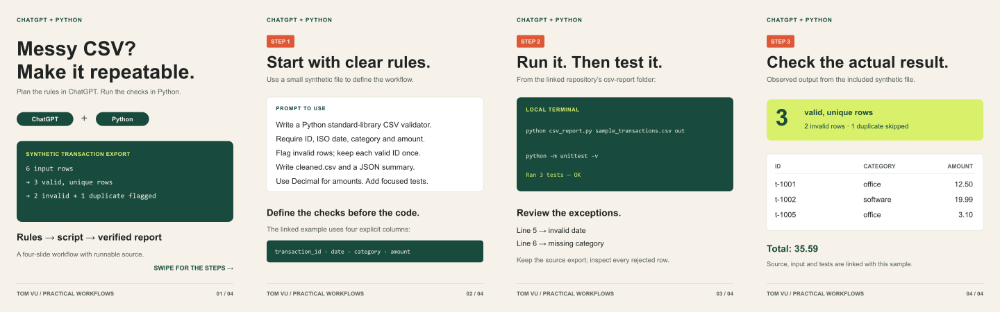

# ChatGPT + Python: CSV workflow carousel

An original four-slide tutorial design demonstration by Tom Vu. It uses a repeatable visual system, large type, concise instructions and actual results from the synthetic [CSV report example](../csv-report/).

## Slides

1. [Hook: messy CSV to repeatable report](slide-01.png)
2. [Define the validation rules](slide-02.png)
3. [Run the script and focused tests](slide-03.png)
4. [Inspect the observed output](slide-04.png)

Each PNG is **1080 × 1350 pixels**. The corresponding SVG files are editable vector sources. This sample was prepared independently for the portfolio; it is not a previous client campaign.

## Factual basis

The prompt on slide 2 is an illustrative prompt the reader can use. It is not a screenshot or transcript of a ChatGPT session, and no live ChatGPT integration is claimed. The terminal commands and output refer to the runnable script in this repository.

On 9 October 2026, running the included synthetic six-row file produced three valid unique rows, two invalid rows and one duplicate skipped. The total was `35.59`; `office` totalled `15.60` and `software` totalled `19.99`. All three included unit tests passed. These are demonstration data, not customer records.

No Instagram, TikTok, Shopify or advertising account was accessed or connected. Brand names identify the tools discussed; this example does not imply endorsement or affiliation.
